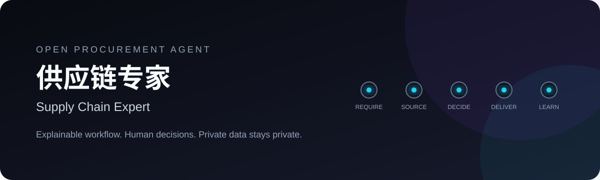
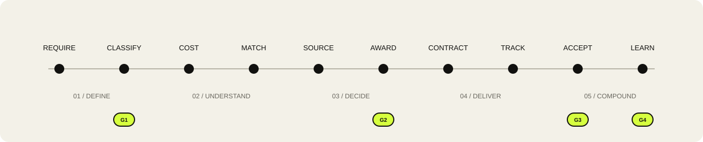

<p align="center">
  
</p>

<p align="center">
  <a href="README.md">简体中文</a>&nbsp;&nbsp;·&nbsp;&nbsp;<a href="README_EN.md">English</a>
</p>

<h3 align="center">Make procurement continuous, clear, and compounding.</h3>

<p align="center">
  <strong>A native procurement profile for Hermes Agent</strong><br/>
  One agent stays with the project from requirement intake to supplier evaluation.<br/>
  AI handles complexity. People own the decisions.
</p>

<br/>

## From list to outcome

<p align="center">
  
</p>

Supply Chain Expert connects ten procurement stages into one project line. Every action retains its stage, evidence, state, and handoff. Four quality Gates place human confirmation exactly where it matters.

<table>
  <tr>
    <td width="25%"><strong>Gate 01</strong><br/><sub>List & classification</sub></td>
    <td width="25%"><strong>Gate 02</strong><br/><sub>Award & contract</sub></td>
    <td width="25%"><strong>Gate 03</strong><br/><sub>Delivery & acceptance</sub></td>
    <td width="25%"><strong>Gate 04</strong><br/><sub>Evaluation & closeout</sub></td>
  </tr>
</table>

## Give purchasing teams their time back

Supply Chain Expert targets repetitive work in list preparation, classification, RFQ generation, quote normalization, progress reporting, and handoffs. Purchasers still own all four Gates, without repeatedly moving fields, reconstructing context, or rebuilding comparison sheets.

For planning a mid-sized engineering procurement project with **200 line items and 5 candidate suppliers**, assuming stable input templates and normal human review:

| Value metric | Planning range |
|---|---:|
| End-to-end manual touch time | **25%–45% lower** |
| List preparation and classification | **1.5–2.5× faster** |
| RFQ preparation and quote normalization | **2–3× faster** |
| Status reporting and handoff | **2–4× faster** |
| Manual effort per project | about **20–30 hours saved** |

These figures are capacity-planning baselines, not guaranteed outcomes. Actual gains depend on input quality, supplier count, historical-data coverage, exception rates, and review depth. The project provides an auditable measurement method: compare manual-baseline hours with agent-assisted hours for the same scope, while tracking rework and Gate review separately. See [`docs/VALUE_MODEL.md`](docs/VALUE_MODEL.md) for formulas and a pilot scorecard.

## One core, four capabilities

<table>
  <tr>
    <td width="50%">
      <h3>01 · Workflow</h3>
      Ten-stage procurement orchestration with continuous project state and recoverable handoffs.
    </td>
    <td width="50%">
      <h3>02 · Intelligence</h3>
      Classification, standardization, cost analysis, supplier matching, and commercial guidance in one context.
    </td>
  </tr>
  <tr>
    <td width="50%">
      <h3>03 · Control</h3>
      Four Gates connect AI recommendations with accountable purchaser confirmation.
    </td>
    <td width="50%">
      <h3>04 · Memory</h3>
      Project facts, confirmed outcomes, and reusable lessons flow back into procurement knowledge.
    </td>
  </tr>
</table>

## Deploy as a Hermes Agent

```bash
# 1. Install Hermes Agent
curl -fsSL https://hermes-agent.nousresearch.com/install.sh | bash

# 2. Install the complete procurement-agent profile
hermes profile install \
  github.com/Hao-Miracle/supply-chain-expert \
  --alias

# 3. Configure and start
supply-chain-expert setup
supply-chain-expert chat
```

Then talk to it directly:

```text
Create a new engineering-procurement project, import the requirement list,
and tell me what is still missing before Gate-1.
```

The installation brings in an isolated Profile, `SOUL.md`, the end-to-end procurement Skill, and the equipment-classification Skill together. Model configuration, sessions, memory, and credentials stay in the user's own Hermes environment. See [`docs/HERMES_DEPLOYMENT.md`](docs/HERMES_DEPLOYMENT.md) for deployment, updates, and messaging-platform setup.

### Optional deterministic business tools

Python sits beneath the agent as a rule and validation layer; it is not the product entry point. Install it when the agent needs classification, RFQ sanitization, or workflow-state validation:

```bash
python -m pip install -e .
```

Hermes can call these capabilities, and they can also be embedded directly in Python:

```python
from supply_chain_expert import ProcurementWorkflow

flow = ProcurementWorkflow("DEMO-001", "Campus network upgrade")

flow.record("requirements", "import", "Requirement list imported")
flow.record(
    "classification_standardization",
    "classify",
    "Classification proposals prepared",
)

flow.approve_gate("gate1", reviewer="purchaser")
external_rfq = flow.prepare_external_rfq({
    "item": "24-port Gigabit Ethernet switch",
    "quantity": 2,
    "internal_cost": 100,
})
```

## The procurement intelligence foundation

| | Capability | Output |
|---:|---|---|
| 01 | Requirements | structured items, missing information, project context |
| 02 | Classification | category, code, normalized specification, confidence, evidence |
| 03 | Cost & market verification | cost analysis, price anomalies, verification evidence |
| 04 | Supplier & sourcing | supplier candidates, RFQ list, comparable quotations |
| 05 | Negotiation & award | negotiation points, consolidated analysis, award recommendation |
| 06 | Contract & delivery | contract/order draft, logistics state, delivery information |
| 07 | Acceptance & feedback | acceptance record, supplier evaluation, procurement knowledge |

Market prices enter the workflow as verification references with specification, brand, unit, tax, freight, region, source, and collection date. External RFQs retain only information intended for external sharing.

## Agent composition

<table>
  <tr>
    <td width="50%">
      <a href="skills/supply-chain-expert/SKILL.md"><strong>supply-chain-expert</strong></a><br/>
      <sub>End-to-end procurement, quality Gates, commercial rules, and handoffs</sub>
    </td>
    <td width="50%">
      <a href="skills/procurement-device-classification/SKILL.md"><strong>procurement-device-classification</strong></a><br/>
      <sub>Explainable engineering-equipment classification and standardization</sub>
    </td>
  </tr>
</table>

| Layer | Role |
|---|---|
| Hermes Profile | isolates model, tools, sessions, skills, and memory |
| `AGENTS.md` | loads procurement workflow and operating rules every session |
| Procurement Skill | drives the ten stages and four Gates |
| Project Memory | restores project state, decisions, files, and next action across sessions |
| Python Tools | performs deterministic classification, sanitization, and validation |

The workflow contract lives in [`docs/WORKFLOW.md`](docs/WORKFLOW.md), value measurement in [`docs/VALUE_MODEL.md`](docs/VALUE_MODEL.md), deployment in [`docs/HERMES_DEPLOYMENT.md`](docs/HERMES_DEPLOYMENT.md), and state in [`schemas/procurement-workflow.schema.json`](schemas/procurement-workflow.schema.json).

## Data boundary

The public repository is composed of generic code, public documentation, and synthetic examples. Organizational procurement data, runtime configuration, and private knowledge stay in the user's own environment. Privacy scanning is built in, together with commercial-field filtering for external RFQs.

```bash
python scripts/privacy_scan.py
PYTHONPATH=src python -m unittest discover -s tests -v
```

## Open source and enterprise services

The core remains Apache-2.0: individuals and organizations may use it commercially under the license. Private deployment, organization-specific taxonomies, procurement knowledge bases, integrations, training, maintenance, and service levels are available as [enterprise services](COMMERCIAL.md). See the [trademark and brand policy](TRADEMARKS.md) for official-identity rules and the [enterprise services agreement template](docs/企业商业服务协议模板.md) for contract preparation.

## Build with us

Issues and pull requests are welcome across procurement workflows, industry taxonomies, data structures, and agent collaboration.

<p align="center">
  <sub>Apache-2.0 · Built for explainable procurement intelligence.</sub>
</p>
