<div align="center">
  
</div>

<div align="center">

[简体中文](README.md) · [English](README_EN.md)

[](https://www.python.org/)
[](LICENSE)


**Put the workflow in the agent. Keep the decisions with people.**

An explainable procurement framework for engineering and IT integration projects.

</div>

## Why Supply Chain Expert?

Procurement is not a single classification or price comparison. It is a continuous decision chain across requirements, pricing, suppliers, contracts, logistics, and acceptance.

Supply Chain Expert turns that chain into an auditable agent workflow. AI prepares, checks, and recommends; accountable purchasers retain control through four explicit Gates. Every step keeps its stage, evidence, status, and handoff, so the project can survive interrupted sessions.

## One complete procurement loop

```mermaid
flowchart LR
    A[Requirements] --> B[Classification & standardization]
    B --> G1{{Gate-1}}
    G1 --> C[Cost estimation]
    C --> D[Supplier matching]
    D --> E[RFQ & comparison]
    E --> F[Negotiation & award]
    F --> G2{{Gate-2}}
    G2 --> G[Contract or order]
    G --> H[Logistics]
    H --> I[Acceptance]
    I --> G3{{Gate-3}}
    G3 --> J[Evaluation & feedback]
    J --> G4{{Gate-4}}
```



| Gate | Purchaser confirms | AI must not do |
|---|---|---|
| Gate-1 | item, category, specification, quantity, and RFQ list | treat a classification suggestion as approved |
| Gate-2 | supplier, price, tax, delivery, award, and contract/order | auto-award or sign a contract |
| Gate-3 | delivered model, quantity, condition, and exceptions | declare final acceptance automatically |
| Gate-4 | supplier evaluation, final facts, open items, and closeout | close a project or confirm knowledge automatically |

## What is included today?

| Capability | Public status | Notes |
|---|---:|---|
| Ten-stage workflow orchestration | ✅ Runnable | stages cannot silently skip or move backwards |
| Four human quality Gates | ✅ Runnable | Gates cannot be approved early and require a reviewer |
| Equipment classification | ✅ Reference implementation | category, code, confidence, evidence, and conflicts |
| External RFQ sanitization | ✅ Runnable | recursively removes internal cost, targets, and competing quotes |
| Market-reference policy | ✅ Runnable | verification-only and never a pricing authority |
| Cost, supplier, comparison, contract | 🧩 Integration contracts | run after connecting private organizational data |
| Logistics and acceptance OCR | 🧪 Unverified extensions | never presented as automated before real validation |

> ERP integration, ERP receiving, sales-order matching, purchase-sales matching, and finance pre-posting are outside this project.

## Run in 60 seconds

```bash
git clone https://github.com/Hao-Miracle/supply-chain-expert.git
cd supply-chain-expert
python -m pip install -e .
```

Start a workflow without real business data:

```bash
supply-chain-expert \
  --project-id "DEMO-001" \
  --project-name "Synthetic demonstration"
```

Try the equipment-classification component:

```bash
procurement-classify \
  --name "24-port Gigabit Ethernet switch" \
  --spec "24GE+4SFP"
```

## Control the workflow in code

```python
from supply_chain_expert import ProcurementWorkflow

flow = ProcurementWorkflow("DEMO-001", "Synthetic demonstration")

flow.record("requirements", "import", "Requirement list imported")
flow.record(
    "classification_standardization",
    "classify",
    "Classification proposals prepared",
)

# A purchaser must approve critical transitions.
flow.approve_gate("gate1", reviewer="purchaser")

# Internal commercial fields are removed recursively before an RFQ leaves.
external_rfq = flow.prepare_external_rfq({
    "item": "synthetic equipment",
    "quantity": 2,
    "internal_cost": 100,
    "target_price": 120,
})
```

`external_rfq` contains only fields safe for external issue. It cannot be produced before Gate-1 approval.

## Market prices verify; they do not decide

Every external price reference must include:

`model/specification` · `brand` · `unit` · `tax` · `freight` · `region` · `source` · `collection date`

Incomplete or stale records require human verification. A market reference cannot directly become the cost, target, transaction price, or automatic award basis.

## Built for agents

The repository ships two reusable Skills:

- [`supply-chain-expert`](skills/supply-chain-expert/SKILL.md): end-to-end workflow, Gates, commercial safety, and handoffs.
- [`procurement-device-classification`](skills/procurement-device-classification/SKILL.md): equipment-classification sub-capability.

See [`docs/WORKFLOW.md`](docs/WORKFLOW.md) for the workflow contract and [`schemas/procurement-workflow.schema.json`](schemas/procurement-workflow.schema.json) for the state schema.

## Privacy is part of the architecture

This repository contains generic code, public documentation, and fully synthetic demonstrations. It does not include:

- real procurement lists, suppliers, customers, quotations, costs, or contracts;
- contact, banking, identity, or credential data;
- agent profiles, environment values, sessions, logs, memories, or runtime databases;
- private correction knowledge or data-IP registration evidence.

Run the release checks:

```bash
python scripts/privacy_scan.py
PYTHONPATH=src python -m unittest discover -s tests -v
```

Automated scanning is necessary but not sufficient; the complete Git change set still requires human review. See [`docs/SECURITY_AND_DATA.md`](docs/SECURITY_AND_DATA.md).

## Repository map

```text
src/supply_chain_expert/        workflow, Gates, and safeguards
src/procurement_classifier/     explainable classification component
skills/                         Agent Skills
schemas/                        workflow and AI audit schemas
examples/                       fully synthetic demonstrations
tests/                          workflow, safety, and classification tests
```

## Contributing

Issues and pull requests are welcome. Use only synthetic or lawfully public data. Never paste real quotations, contracts, contacts, account details, or private screenshots into an issue, test fixture, or commit.

## License

[Apache License 2.0](LICENSE)
